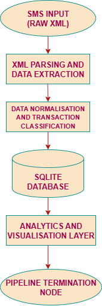

# MOMO SMS Data Project

## Team Information
**Team Name:** Team 1

**Members:**
- Angel Kibui
- Brenda Maina
- Ndunge Mbithi

---

## Project Description
This project builds an enterprise-style fullstack application to process and analyze MoMo SMS transaction data. The system ingests raw MoMo SMS XML files, extracts transaction fields, cleans and normalizes timestamps, phone numbers and amounts, and categorizes transactions (e.g., inflow, outflow). Processed records are stored in a SQLite database and aggregated into a `dashboard.json` file used by a lightweight HTML/JS dashboard to display charts and transaction tables.

The project emphasizes a reproducible ETL pipeline, clean data handling, collaborative development (Codespaces, branching, PRs), and an architecture that supports adding a REST API (FastAPI) for integrations.

---

## Scrum Board
We manage project tasks using a task board (ClickUp/Trello).  
[View our Scrum Board here](https://app.clickup.com/90121191829/v/li/901212276633)

# Momo-SMS-Data
Enterprise fullstack app to process MoMo SMS XML, store in SQLite, and visualize analytics.
## 🏗️ System Architecture

This repository implements a simple ETL pipeline for mobile money SMS data.  
See the high-level flow and diagram below.

